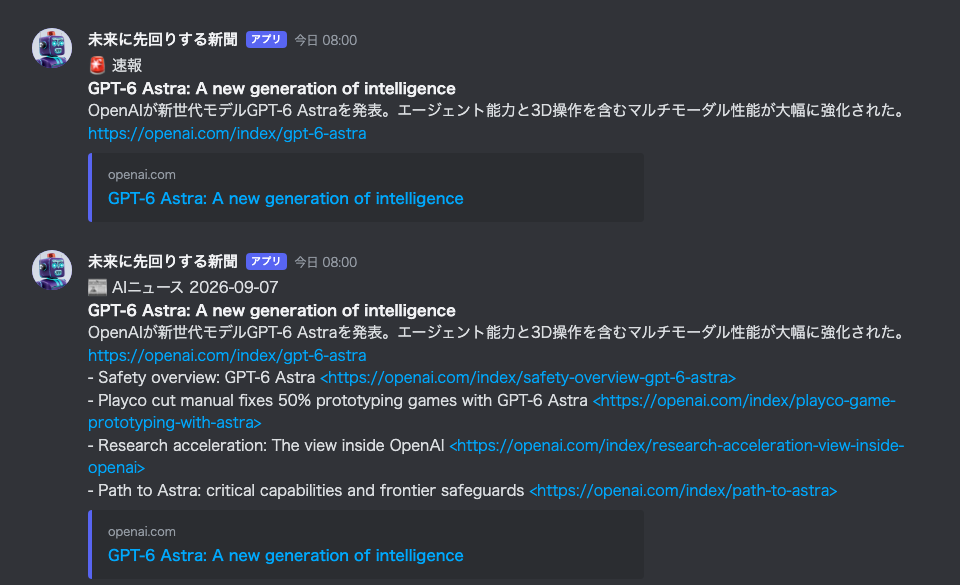

# ai-news-bot — 未来に先回りする新聞

AIの「ワクワクする」ニュースだけを厳選して、Discordに1日1回届けるbot。
Discord上では **「未来に先回りする新聞」** の名前とアイコンで投稿します
（表示名・アイコンは `.env` の `BOT_DISPLAY_NAME` / `BOT_AVATAR_URL` でいつでも変更できます）。

新モデルのリリース、驚きのベンチマーク、話題のデモやOSSなど、
**技術者が「これ自分でも触ってみたい」と手を動かしたくなるニュース**をAIが選んで流します。
資金調達・人事などのビジネスニュースは流しません。



上は投稿フォーマットの見本です（実在の記事を題材にした合成画像。配信経路自体はテストチャンネルへの
実配信で検証済み）。超大型ニュースだけの「🚨 速報」と、毎朝8時の「📰 ダイジェスト」
（トップ1本＋次点、次点はリンクプレビューを抑制）の2種類を投稿します。

## 使い方

DockerとDocker Composeを導入した環境で、次を実行します。

```bash
./setup.sh
```

対話形式でWebhook URLとLLM設定を入力すると起動します。詳細なVPS導入と運用方法は [DEPLOY.md](DEPLOY.md) を参照してください。

## 予定している構成

```
collector（情報源を30分ごと巡回）
  → SQLite（既読管理・候補プール）
  → curator（LLMがワクワク度を採点）
  → poster（Discord Webhookへ投稿）
```

- 基本は1日1回の定時ダイジェスト（トップ1本＋次点2〜4本）
- 超大型ニュース（例: 主要モデルの新リリース）だけは即時速報（1日最大+1回）
- 選定基準はプロンプトファイルで管理し、コードを触らず調整可能

## デプロイ

KAGOYAクラウドVPS上で Docker Compose により稼働させます。

```bash
git clone https://github.com/Yanagi-1112/ai-news-bot.git
cd ai-news-bot
./setup.sh   # 対話形式でWebhook URL等を設定 → 自動起動
```

日常の確認は `./manage.sh status`、ログ確認は `./manage.sh logs` を使います。
